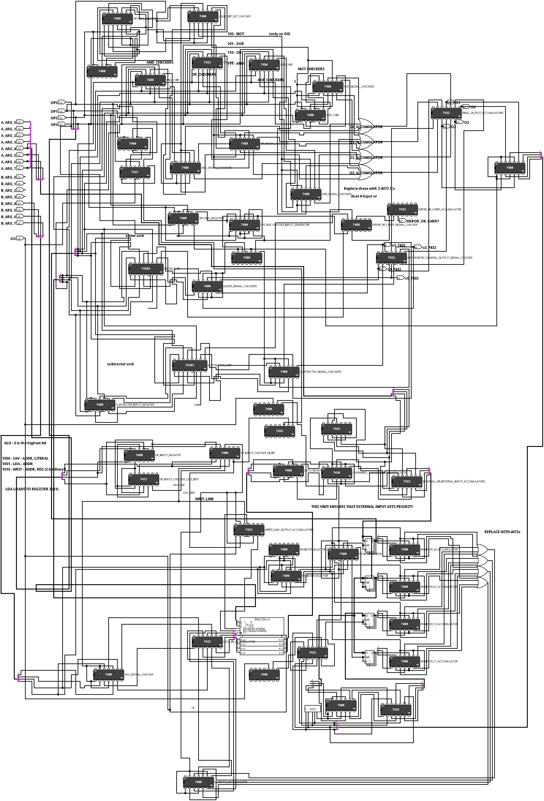
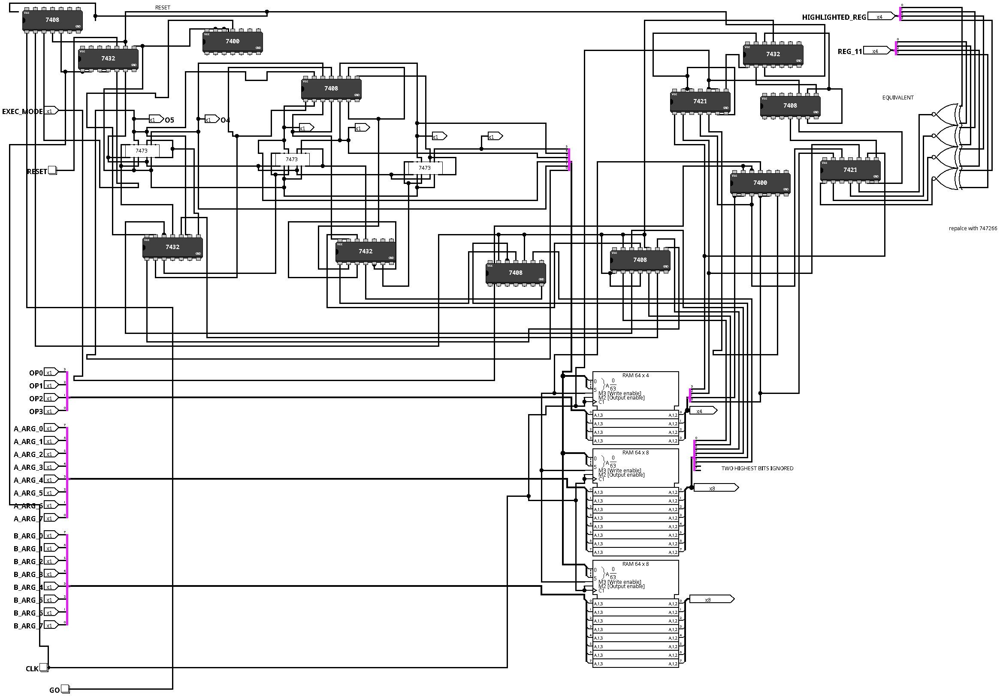

# werdl/4bit
## Features
- Custom 4-bit ALU, supporting AND, OR, XOR, NOT, full add and full subtract
- 256 nibbles of general use memory
- Four registers, used for I/O to/from the ALU
- Program counter with jump and jump if zero instructions
## Instruction Set
| Binary Value | Assembly Mnemonic | `A_ARG` value | `B_ARG` value | Operation Description | Implemented |
|-             |-                  |-               |-              | -                     | -         |
|`0000`| `ADD` | None | None | Adds reg 00 to reg 01 and stores in reg 10 | ✅ |
|`0001`| `SUB` | None | None | Subtracts reg 01 from reg 00 and stores in reg 10 | ✅ |
|`0010`| `REG` | 4 bit literal | 2 bit register address | Stores `A_ARG` in reg `B_ARG`| ✅ |
|`0011`| `NOP` | None | None | None | ✅ |
|`0100`| `NOT` | None | None | Logically inverts the contents of reg 00 and stores in reg 10 | ✅ |
|`0101`| `XOR` | None | None | Performs logical XOR on registers 00 and 01 and stores in reg 10 | ✅ |
|`0110`| `OR` | None | None | Performs logical OR on registers 00 and 01 and stores in reg 10 | ✅ |
|`0111`| `AND` | None | None | Performs logical AND on registers 00 and 01 and stores in reg 10 | ✅ |
|`1000`| `SAV` | 8 bit address | 4 bit literal | Saves `B_ARG` to memory address `B_ARG`| ✅ |
|`1001`| `LDA` | 8 bit address | 2 bit register address | Loads memory address `A_ARG` to reg `B_ARG`| ✅ |
|`1010`| `WRIT` | 8 bit address | 2 bit register address | Saves reg `B_ARG` to memory address `A_ARG` | ✅ |
|`1011`| Reserved | - | - | - | ❌ |
|`1100`| `JMP` | 6 bit address | None | Jumps to PC address `A_ARG`| ✅ |
|`1101`| Reserved | - | - | - | ❌ |
|`1110`| `JCU` | 6 bit address | 2 bit register address | If register `B_ARG` is equal to register 11, jumps to memory address `A_ARG` | ✅ |
|`1111`| Reserved | - | - | -| ❌ |
### Notes on the instruction set
- There are 4 "namespaces" (bitfields)

| `Binary range` | `Use` | `# uses`
|-|-| - |
| `0000` - `0011` | Arithmetic uses | 2 + `NOP`
| `0100` - `0111` | Logical operations | 4
| `1000` - `1011` | Memory manipulation operations | 3
| `1100` - `1111` | Control flow operations | 3 (only 1 implemented)

- I think it is Turing-complete or near to it? I am pretty sure it is with manual instruction entry on the ALU/Memory Unit, but the PC I am less sure of

## Example Programs
### A simple program that adds 1 to a number in memory address 0x00 and stores it in memory address 0x01
```asm
LDA 0x00 00 ; Load the number from memory address 0x00 into reg 00
REG 1 01 ; Store the literal 1 in reg 01
ADD ; Add reg 00 to reg 01 and store in reg 10
WRIT 0x01 10 ; Write the result to memory address 0x01
```

## Circuitry
> Fully designed in Logisim, using the built in TTL library and also [this library](https://github.com/r0the/logi7400). A few logic gates are included for more obscure ICs, but they will be replaced either with said ICs or with equivalent chips in series.
### ALU/MU
The ALU/MU is the heart of the computer, and is where all the computation is done. It is a 4-bit ALU, with 256 nibbles of general use memory. The ALU/MU is connected to the program counter, and is where the instructions are executed. The MU contains the registers and the memory.

### Program Counter
The program counter is a simple counter that increments by one each clock cycle. It is connected to the ALU/MU, and is where the instructions are fetched from memory. The CLK input loads the current instruction into the ALU/MU, and the GO input executes the instruction. It is programmable, and can jump to any address in memory, using the `JMP` and `JCU` instructions.


## Contributing or Building
If you are interested in helping out, please first submit an issue, to check if your idea is in line with the project. If it is, feel free to fork the project and submit a pull request. If you are building the project, please let me know, I would love to see it! If any help is needed, feel free to ask, I would be happy to help. 

Contact me (werdl) at [werdl_@outlook.com](mailto:werdl_@outlook.com).

## Contributors
- werdl (designing, building, programming and documenting the computer)
- uimaxbai (building with me, hopefully!)
- jdh and Ben Eater for inspiration
